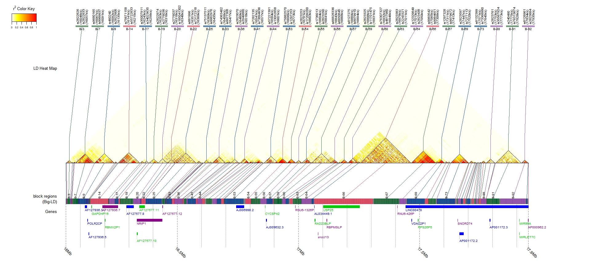

Big-LD: A new haplotype block detection method
================
Sunah Kim (<sunny03@snu.ac.kr>)

Big-LD
======

Big-LD is a block partition method based on interval graph modeling of LD bins which are clusters of strong pairwise LD SNPs, not necessarily physically consecutive. The detailed information about the Big-LD can be found in our paper published in [bioinformatics](https://academic.oup.com/bioinformatics/article/doi/10.1093/bioinformatics/btx609/4282661/A-new-haplotype-block-detection-method-for-dense).

The Big-LD algorithm and visualization function has been updated and implemented in a new package "gpart". The package "gpart" can be downloaded from [bioconductor](https://bioconductor.org/packages/devel/bioc/html/gpart.html)

The "gpart" has following features.

### the updated `BigLD` function

-   supports two types of heuristic algorithm, `near-nonhrst` and `fast`.
-   supports LD measures r2 and D' both.
-   supports PLINK formats (.ped, .map, .raw, .traw) and vcf format as input

### the updated `LDblockHeatmap` function

-   shows up to 20000 SNPs.
-   shows physical locations of LD blocks and SNPs
-   shows gene locations if the gene information is inputted (or by loading gene information from the Ensembl or UCSC database) .

### the new SNP sequence partition algorithm `GPART`

-   divides the entire SNP sequence using LD block information (BigLD result) and gene information
-   can limit the min/max size of a block

### A BigLD result plotted by the updated `LDblockHeatmap()` in "gpart" package..

-   EAS population of 1000 Genomes phase 1 data
-   chr1:16Mb-17.9Mb
    
